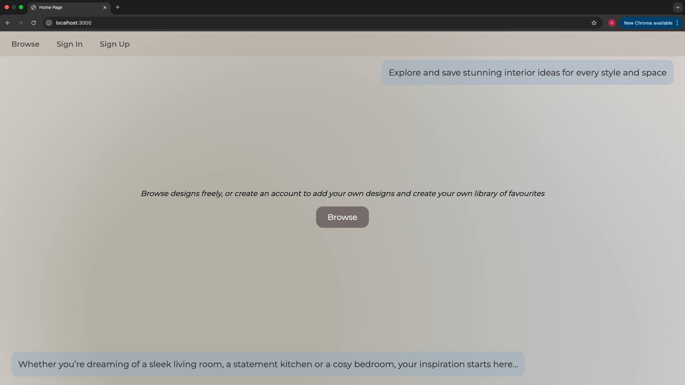
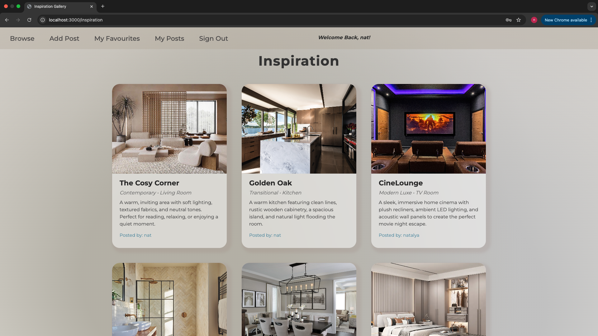
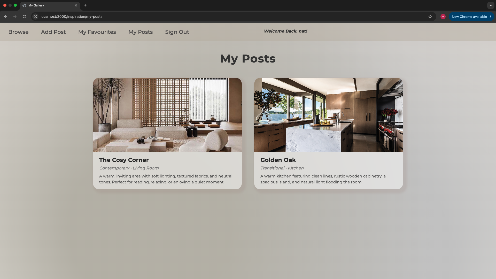
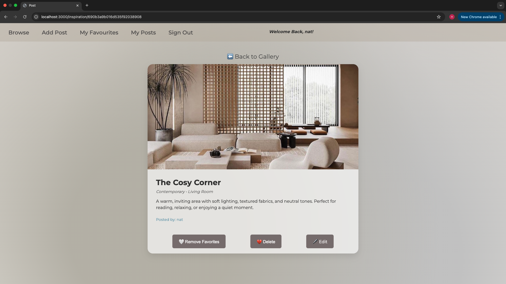
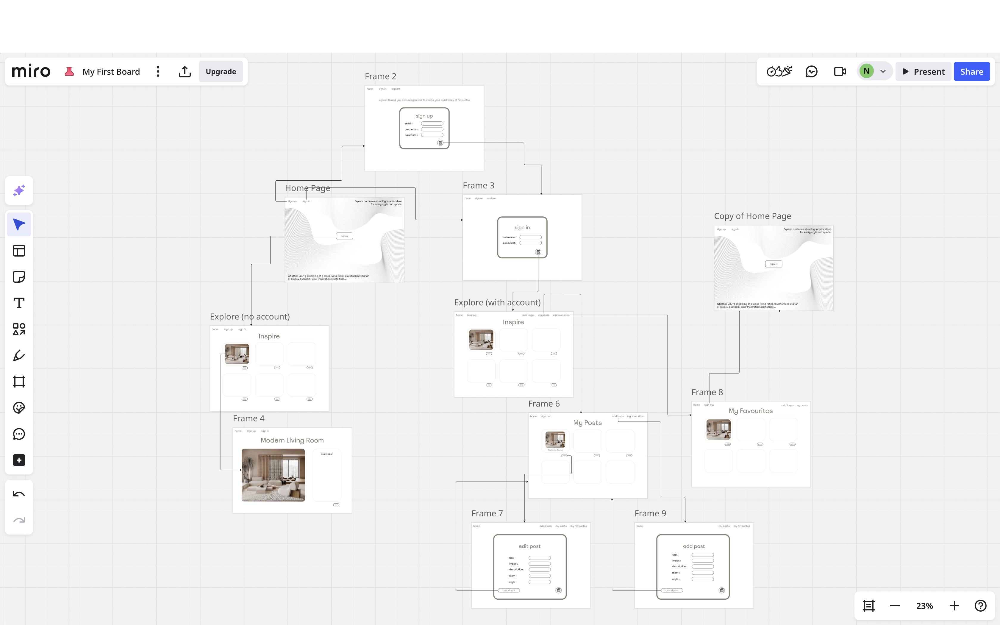
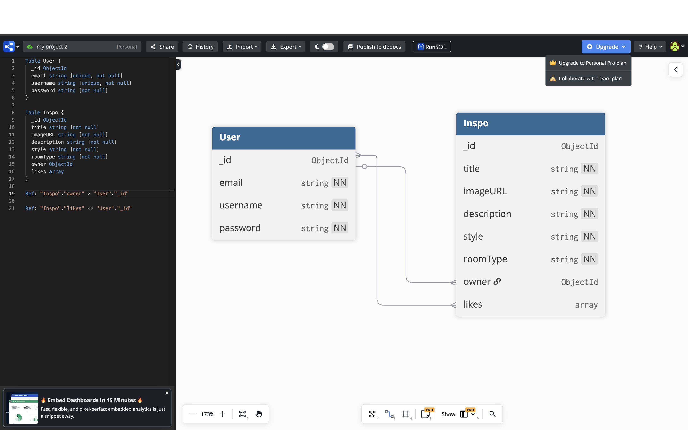

<h1 align='center'> Home Design Inspiration App 🏡</h1>

## Description
A full MEN stack CRUD app built after completing Module 2 of the Software Engineering Bootcamp.
It allows users to browse, post and favourite different home decoration inspiration posts. Similar to pinterest but tailored for interior design lovers.

## How it Looks





## Deployment Link
Deployed on: homedesignapp-natalya.netlify.app

## Getting Started / Code Installation

1 Clone the Repository

``git clone https://github.com/natalya-nassimi/home-design-app-project.git``

2 Navigate into the project folder and open

``cd home-design-app-project``

3 Install dependencies

``npm install``

This app uses Cloudinary's image upload service. This requires 3 additonal environment variables to be added to the .env file as below.
Create an account at cloudinary.com if you don't already have one. You will find your 'Cloud name' on the Home Dashboard page. Click 'Go to API keys' and you will find your API Key and API Secret. Ensure you use the variable names listed below.

4 Create a .env file to include:

```  
    MONGODB_URI=mongodb+srv:// ...
    SESSION_SECRET=
    CLOUDINARY_CLOUD_NAME=
    CLOUDINARY_API_KEY=
    CLOUDINARY_API_SECRET=
```

5 Run the app (Ensure you have Node.js installed)

``npm start``

6 Visit the URL http://localhost:3000


## Time Frame and Team
This was a 7 day solo project.


## Technologies Used
- Back end: Node.js, Express, MongoDB, Mongoose
- Front end: EJS, HTML, CSS
- Authentication: express-session, bcrypt

## Brief
Create a MEN stack CRUD app to include:
- RESTful routes
- MVC structure
- Session-based authentication
- Full CRUD functionality
- Front end rendered using EJS templates

## Planning
My first steps were to construct user stories and wireframes for a clear idea of my final goal. Followed by creating an ERD to map the relationships between the User and Inspo models. I also devised a clear plan, dividing the work evenly over the 7 day duration.

### Tools:
- **Trello** for project management
- **Miro** for wireframes


- **DBDiagram** for ERD


## Build / Code Process
Steps:
- Set up Express, schemas and Mongoose models and routes.
- Implement user authentication with sessions and middleware for access control.
- Implement full CRUD functionality for inspo posts.
- Render EJS templates for each page, including conditional rendering to display buttons that should be visible to the owner only.
- Implement image upload using Cloudinary.
- Style main gallery page, forms and show pages using CSS for a clean and usable app.

### Code Snippet 1 
This route handles creating a new inspo post. When the user selects an image it is sent to Cloudinary and the returned URL is stored in the database. Each post is linked to the user that is logged in to ensure posts are attributed to their creators and allows for futher permission control when editing and deleting. This code snippet demonstrated file handling and session usage.

```
router.post('', isSignedIn, upload.single('imageURL'), async (req, res) => {
    try {
        if (req.file) {
            const uploadResult = await uploadBuffer(req.file.buffer)
            req.body.imageURL = uploadResult.secure_url
        }

        req.body.owner = req.session.user._id
        const newInspo = await Inspo.create(req.body)
        return res.redirect(`/inspiration/${newInspo._id}`) 

    } catch (error) {
        console.error(error)
        return res.status(500).send('Something went wrong')
    }
})
```
### Code Snippet 2
This code dynamically renders buttons based on the status of the user that has signed in. The favourites toggle is controlled by ``checkLikes`` which checks the database array of users who have favourited the post. If the signed in user owns the post they also have options to edit or delete it. This provides a personalised UI and prevents unauthorised users from certain actions.
```
<div class="button">
    <% if (user) { %>
        <%if (checkLikes) { %>
            <form action="/inspiration/<%= inspo._id %>/favourited-by/<%= user._id %>?_method=DELETE" method="POST">
                <button type="submit" class="favourite-btn">🤍 Remove Favorites</button>
            </form>
        <% } else { %>
            <form action="/inspiration/<%= inspo._id %>/favourited-by/<%= user._id %>" method="POST">
                <button type="submit" class="favourite-btn">❤️ Add to Favorites</button>
            </form>
        <% } %>
    <% } %>

    <% if(user && inspo.owner._id.equals(user._id)) { %>
        <form action="/inspiration/<%= inspo._id %>?_method=DELETE" method="POST">
            <button class="delete-btn">💔 Delete</button>
        </form>
        <a class="edit-btn" href="/inspiration/<%= inspo._id %>/edit">🖊️ Edit</a>
    <% } %>
</div>
```

### Code Snippet 3
This middleware allows temporary flash messages to be displayed in views. It stores ``req.session.message`` in ``res.locals.message`` to make it accessible in the EJS templates. It also clears the message so it doesn't remain in the view across further requests. Next() then forwards to the next middleware. This improved user experience during form submissions.
```
const passMessageToView = (req, res, next) => {
    res.locals.message = req.session.message
    req.session.message = null
    next()
}

export default passMessageToView
```

## Challenges
- Implementing a functional 'Add to Favourites' and 'Remove Favourites' feature. 
I updated the EJS conditional logic to render the correct button state depending on whether the post was already favourited.

- Ensuring that only the creator of the post could edit or delete, as initially non-owners were able to access the edit URL manually.
I enforced this using middleware and server side checks to verify ``req.session.user._id`` matched ``owner._id``. This improvement was crucial in protecting resources on the backend.

- CastError where express tried to interpret static routes as dynamic IDs. I realised this was because my dynamic route was declared before the static routes in my controller.
Resolving this conflict gave me a clearer understanding of route priority in Express.

## Wins
- Clean and intuitive user experience. I spent time designing the interface to make the app feel intuitive and visually polished. For example, I ensured images loaded correctly and were positioned cleanly in the gallery, styled buttons and text and made sure the colour scheme was consistent.

- Implementing secure ownership and checks successfully, through adding middleware and conditional rendering. Gives the app a professional layer, both in UX and data integrity.

- Successful implementation of full CRUD operations across the app.

- Creating distinct views for users to track both their own posts and their favourite inspiration posts made the app feel more personal and complete.

## Key Takeaways
- Working on this Home Design App Project was definitely the most valuable learning experiences of my full-stack journey so far. It provided me with the opportunity to bring together everything I have learned previously and apply it to a full application. The project helped me piece together my understanding of front-end and back-end logic and how to make these layers communicate effectively. 

- Throughout the project I developed a more methodical approach to debugging. I was able to isolate issues, test routes individually and use console logs productively. I am now more confident using the terminal to inspect server responses and errors.

- Confidence in styling best practices and an understanding of the importance of visual design and user experience.

- Integrating Cloudinary for uploading images was good experience in working with third-party APIs and managing external resources securely.

- This was an extremely valuable experience in taking a project from an idea to deployment independently. I was able to plan my work, manage my time, approach challenges systematically and debug features independently.

## Bugs
- No client side resizing or warning for oversized files.
- On very small screens, some text in the gallery cards may overflow slightly.
- No flash error messages for URL manipulation by non-owners (e.g. edit).

## Future Improvments
- Implement search and filter by style or room type.
- Improve mobile responsiveness.
- Product details or suggestions based on the image in the post.